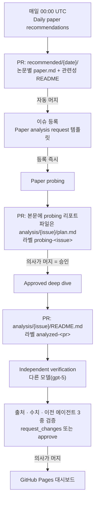

# Medical Literature SDLC

읽기 전용 환자 데이터를 근거로 Copilot이 최신 논문을 찾아오고, 의사가 GitHub의 이슈와
PR 위에서 분석 범위를 정하고 승인하며, 두 번째 모델이 결과를 독립 검증한 뒤 대시보드로
배포되는 템플릿입니다.

LLM은 코드가 아니라 판단을 담당합니다. 스크립트는 데이터를 가져다 주기만 하고, 무엇이
관련 있는지, 어떻게 보여줄지, 무엇을 결론지을 수 없는지는 전부 모델이 정하고 사람이
PR에서 승인합니다.

## 파이프라인



| 단계 | 워크플로 | 트리거 | 산출물 |
|---|---|---|---|
| 1. 수집 | `daily-paper-recommendations.md` | 매일 크론 · 수동 | `recommended/{date}/` |
| 2. probing | `paper-probing.md` | 이슈 등록 | PR 본문 리포트 + `analysis/{issue}/plan.md` |
| 3. 딥다이브 | `paper-deep-dive.md` | probing PR 머지 | `analysis/{issue}/` |
| 4. 검증 | `analysis-verification.md` | 3단계 완료 · 수동 | `checks` 기록 + PR 리뷰 |

수집만 자동 병합되고, 나머지 단계는 PR을 만들 뿐 스스로 머지하지 않습니다. 머지가 곧 의사의 승인입니다.

### 1. 수집

Copilot이 먼저 마스킹 뷰를 조회해 코호트를 파악하고, **검색어를 스스로 작성해**
15개 매체를 한 번에 검색합니다. 하루치에서 3편이 모이지 않으면 7일, 30일로 창을
넓히되 관련성 기준은 낮추지 않습니다.

| 매체 | 경로 |
|---|---|
| Nature, Nature Medicine, Nature Communications, Nature Biomedical Engineering | OpenAlex |
| npj Digital Medicine, The Lancet Digital Health | OpenAlex |
| Radiology, Radiology: Artificial Intelligence, European Radiology, Medical Image Analysis | OpenAlex |
| MICCAI, IPMI, CVPR, NeurIPS, ICLR | arXiv |

매체 구성은 **임상의가 실제로 읽는 곳**에 무게를 둡니다. 방법론 학회는 영상의학 실무에
닿는 곳만 남겼습니다 — 방법이 아무리 강해도 임상에서 쓸 수 없는 논문은 여기서 소음입니다.

학회 논문은 OpenAlex 색인이 최근 회차를 담지 못하므로, 채택 사실이 적히는 arXiv의
comment 필드로 검색합니다. 두 API 모두 로그인이 필요 없고 `tools/search_papers.py`가
15개 매체를 병렬로 조회한 뒤 제목 기준으로 중복을 제거합니다.

### 2. probing

의사가 `Paper analysis request` 이슈 템플릿으로 논문 하나와 집중해서 볼 지점을
남기면, 논문의 데이터셋과 우리 코호트를 표로 비교하고, 어떤 insight를
얻을 수 있고 무엇은 결론지을 수 없는지, 그리고 **어떤 시각화와 레이아웃으로 보여줄지**를
제안합니다. 실제 분석은 하지 않습니다. 이 PR을 머지하는 것이 기획 승인입니다.

### 3. 딥다이브

승인된 기획서를 계약으로 삼아 분석을 실행합니다. 산출물은 두 개입니다 — 대시보드가
읽는 정형 `analysis.json`, 그리고 임상의가 PR에서 읽는 `README.md`. README에는 보고한
모든 수치 뒤의 쿼리를 함께 적습니다.

### 4. 검증

앞 단계와 **다른 모델**이 아무것도 믿지 않고 다시 확인합니다.

- **출처** — 인용, DOI, 저자, 게재일을 직접 조회해 대조
- **데이터 분석** — SQL을 새로 작성해 모든 수치를 재현하고 분모·부분군 크기·표본이
  뒷받침하지 못하는 주장을 확인
- **이전 에이전트** — 승인된 기획서와 대조해 범위 이탈, 누락, 오해를 부르는 시각화,
  사라진 유보 표현, 환자 정보 유출 점검

세 관문의 결과는 `analysis.json`의 `checks`에 그대로 기록되어 대시보드에 함께 표시되고,
하나라도 통과하지 못하면 `request_changes`로 수정을 요청합니다.

## 데이터 보호

LLM은 `llm_reader` 역할로 `llm.hospital` 뷰만 읽습니다. 이름과 주민번호는 뷰에서 이미
마스킹되어 있고 나머지 비공개 컬럼은 권한으로 차단됩니다. `query-medical-db` 도구는
`SELECT`/`WITH`로 시작하는 쿼리만 실행합니다.

## 시작하기

실습으로 처음 돌려보신다면 [instructions.md](instructions.md)를 따라가세요.

이 저장소를 템플릿으로 새 저장소를 만든 뒤:

1. Settings → Actions → General → **Allow GitHub Actions to create and approve
   pull requests** 활성화
2. Secret `LLM_DB_PASSWORD` 등록

3. Settings → Pages → Source를 **GitHub Actions** 로 지정

대시보드는 병합될 때마다 다시 만들어져 `https://<사용자>.github.io/<저장소>/` 로
배포됩니다. Pages는 public 저장소이거나 유료 플랜의 private 저장소여야 동작합니다.
빌드 결과인 `site/index.html`은 저장소에 커밋하지 않습니다. 데이터가 들어 있는 단일
파일이라 로컬에서 만들어 그냥 열어도 똑같이 동작합니다.

### 로컬에서 데이터베이스 실행

```bash
docker compose up -d
./db/test-access.sh
```

### 로컬에서 대시보드 확인

```bash
python3 tools/build_dashboard.py --check   # 빌드 로직 자체 점검
python3 tools/build_dashboard.py           # site/index.html 생성
open site/index.html                       # 서버 없이 그대로 열립니다
```

대시보드는 데이터를 파일 안에 담은 단일 HTML입니다. fetch도 모듈도 외부 요청도 없어서
병원 노트북에서 더블클릭 한 번으로 열립니다.

## 구성

```text
.
├── .github/
│   ├── ISSUE_TEMPLATE/paper-analysis.yml
│   └── workflows/
│       ├── shared/medical-db.md          # DB 서비스 · 마스킹 뷰 조회 도구 (공용)
│       ├── daily-paper-recommendations.md
│       ├── paper-probing.md
│       ├── paper-deep-dive.md
│       ├── merge-collection.yml           # 수집 PR 자동 병합
│       ├── analysis-verification.md
│       └── build-dashboard.yml          # 대시보드 빌드 후 Pages 배포
├── db/                                   # PostgreSQL 이미지, 마스킹 뷰, 합성 데이터
├── tools/build_dashboard.py              # 저장소 → site/index.html
├── recommended/{date}/                   # 1단계: {slug}/paper.json · README.md
├── analysis/{issue}/                     # 2단계 plan.md · 3단계 analysis.json · figure.svg · README.md
└── site/
    └── dashboard.template.html           # 날짜 / 논문 / 분석 3컬럼 대시보드
```

`.lock.yml` 파일은 `gh aw compile`이 생성합니다. 직접 수정하지 말고 `.md`를 고친 뒤
다시 컴파일하세요.

모든 산출물은 임상 사용 전 의사의 검토가 필요합니다.
